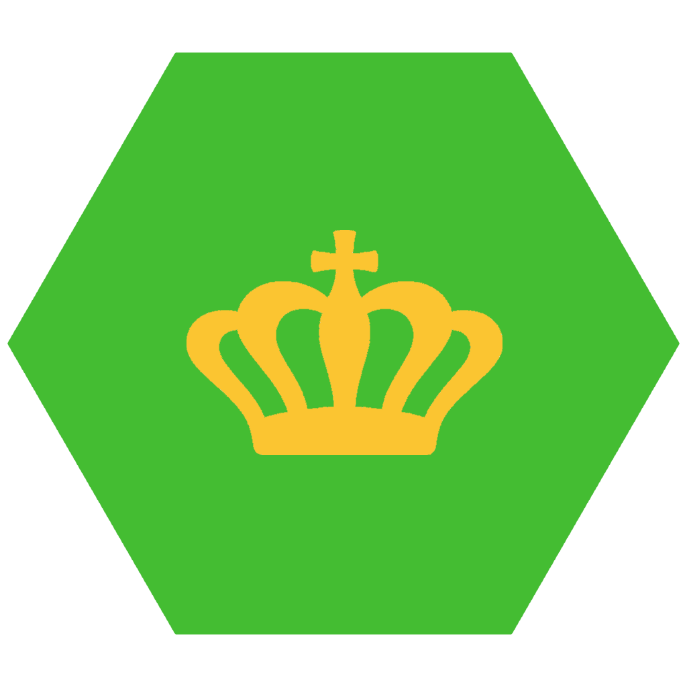
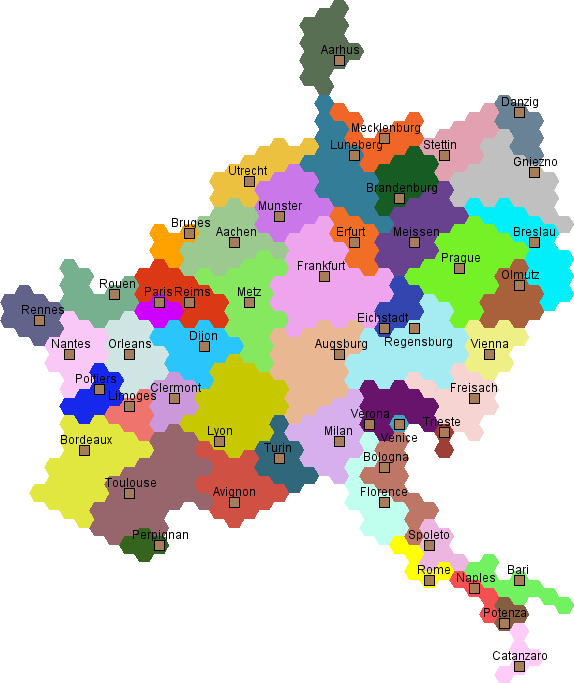
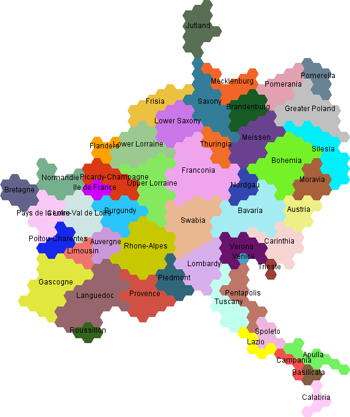
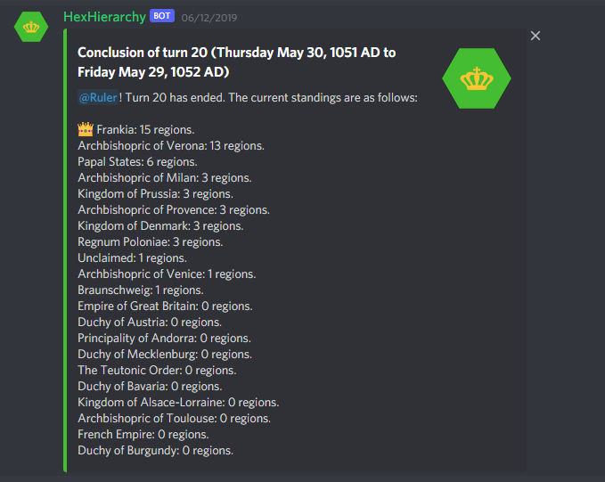

# HexHierarchy

## Description

A chat-bot-based game based around the idea of territory conquest on a map made of hexagons. Loosely based on risk but with less random factors. The game is controlled through chat commands and responses come in the form of images and formatted messages.

Turns progress daily at midnight, and players can enter their turns at any time during the day. The game features wars, alliances, armies, and economics.

Originally written due to discussing the idea of a hex-based strategy game about feudal politics and war, built to improve my skill with SQL. Unfortunately many of the routines and configurations of the MySQL database were lost and did not make it to this repository.

## Images

## Future Work

- HexHierarchy 2, for either web, IRC, or both

